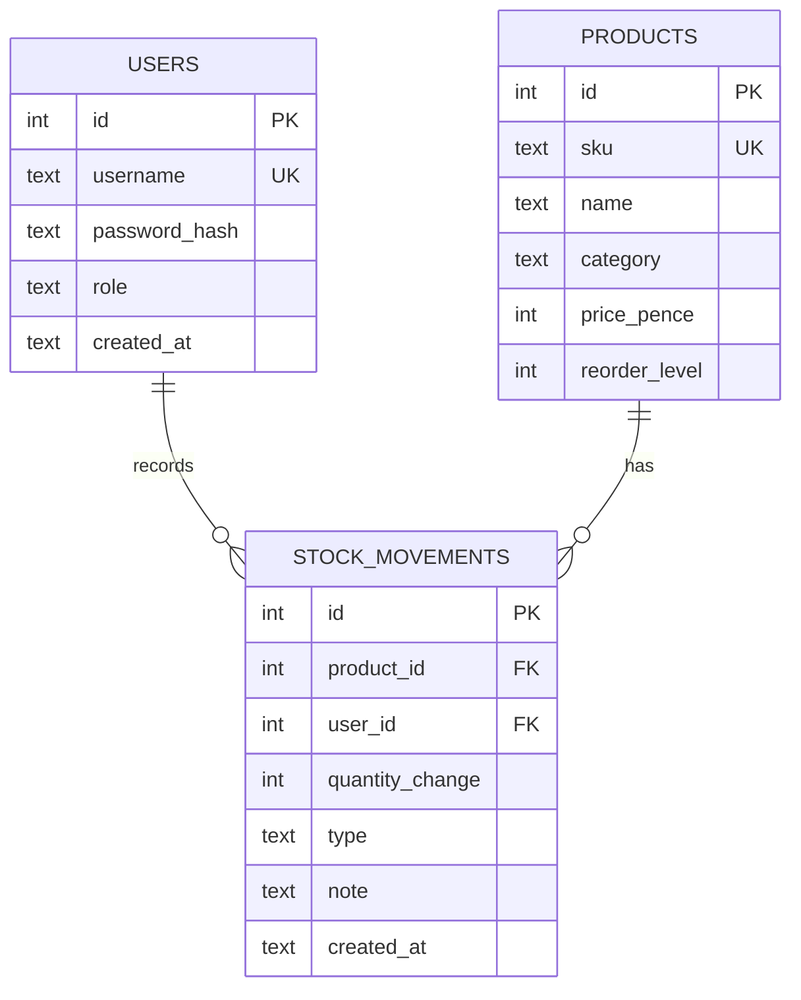

# Database Schema

```mermaid
erDiagram
  USERS ||--o{ STOCK_MOVEMENTS : records
  PRODUCTS ||--o{ STOCK_MOVEMENTS : has
  USERS {
    int id PK
    text username UK
    text password_hash
    text role
    text created_at
  }
  PRODUCTS {
    int id PK
    text sku UK
    text name
    text category
    int price_pence
    int reorder_level
  }
  STOCK_MOVEMENTS {
    int id PK
    int product_id FK
    int user_id FK
    int quantity_change
    text type
    text note
    text created_at
  }
```

Current stock for a product is the sum of its `quantity_change` values.